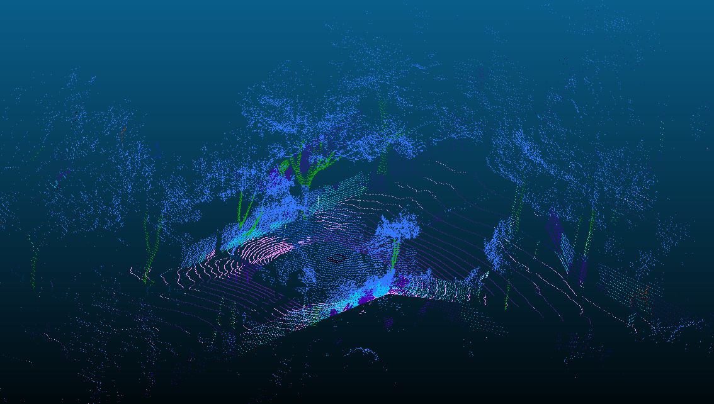

# IndesIAHack - CityScan

El reto porpuesto por Acciona consistía en la extracción de información de calles utilizando datos proporcionados por un sensor LIDAR.

## Nuestra solución:

Hemos utilizado modelos preetrenados (RandLANet y Kpconv) para la detección de estructuras en nubes de puntos 3D y añadido implementación para la detección de arboles, señales, calzada...

## Requisitos

- python 3.10
- dataset 1756674415 que contiene los datos LIDAR (no incluido en el repositorio)
- dependencias de pip dentro de requirements.txt

## Estructura

Por la limitada cantidad de espacio que podemos subir y el peso del .pcd hemos dejado un par de ejemplos subidos en cada carpeta.

- heatmap.py: calcula el heatmap de la nube de puntos utilizando la reflectividad de cada punto utilizando datos .xyz (salida en heatmaps/)
- RLAN.py: utiliza el modelo RandLANet para detectar estructuras en un dado .xyz (salida en resultados_randlanet).
- kpc.py: utiliza el modelo kpconv para detectar estructuras en un dado .xyz (salida en resultados_kpconv).
- pcd_classification: utiliza los .pcds calculados previamente para visualizar elementos por separado como la acera, detectar sus dimensiones y calcula también un clustering para los diferentes árboles en la calzada (salida en class). 
- signal_detection.py: Utiliza análisis IQR para detectar valores altos de reflectividad y despues DBSCAN para detectar señales en la carretera (salida en señales_detectadas)
- uploads_read_raw_ciudad.py: muestra las fotos del lidar permitiendo guardarlas (en full_ciudad). Antes los datos se dejan en formato xyz con una columna para cada coordenada, la reflectividad y el infrarrojo.

Los modelos preentrenados no se incluyen en el repositorio pero se instalarán automáticamente al ejecutar RLAN.py o kpc.py.
Para cambiar el archivo que se procesa en cada archivo basta con cambiar la variable path al principio de cada archivo.

